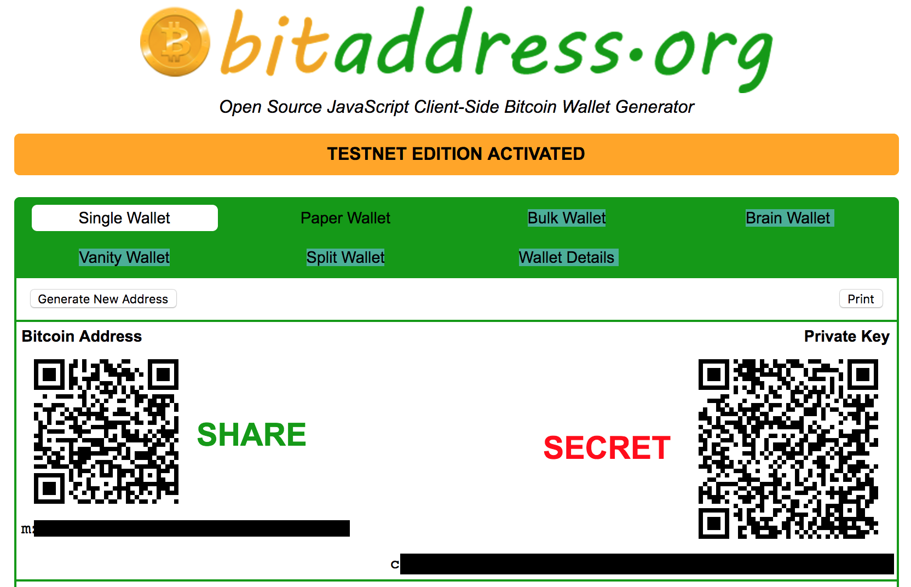

# Create BTCR DID

This is a prototype-only script to create BTCR DIDs.


## Install 
```
git clone git@github.com:WebOfTrustInfo/btcr-did-tools-js.git
npm install
```

## Preparation

We recommend starting in testnet mode. You will need testnet addresses for the input address and the change address.

If you are new to this, please start with the instructions in "Getting started with Bitcoin and testnet", at the end

## Ensure your private key WIF is available as an environment variable

```
export WIF=<privateKeyWif>
```

## Create BTCR DID with DDO/1 ref

```
node createBtcrDidCmd.js -i <inputAddress> -c <changeAddress> -d <link-to-ddo.jsonld>

```

## Create BTCR DID without DDO/1 ref

```
node createBtcrDidCmd.js -i <inputAddress> -c <changeAddress>

```

## Usage

The default node is testnet; call `--help` for more options
 
```
node createBtcrDid.js --help
```

## Get hex-encoded public ket from wif

```
node utilCmd.js -n <mainnet|testnet>

```


## Getting started with Bitcoin and testnet

### How to generate testnet addresses
If you don't have a testnet address yet, and don't know how to create one, you can start with this client-side address generator: [https://www.bitaddress.org/?testnet=true](https://www.bitaddress.org/?testnet=true).

As this is a client-side address generator, and will be passing private keys, go ahead and disconnect your internet connection. Even though this is testnet mode, it's a good practice to start following.

Once you've disconnected from the internet and generated a testnet address, record the Bitcoin address (what you can share with the public) and the Private Key (always keep this private). The private key is in Wallet Import Format (WIF). 




### How to get testnet funds

Lastly, you'll need some funds in your input (funding) address before creating the Bitcoin testnet transaction in the following steps.

To get some testnet funds, search for a testnet faucet and send to your input address.

Be sure to hold onto your private keys. Even in testnet mode, you'll want to send your testnet coins back to the faucet provider when you are finished. This tool only uses a small amount of money, and many testnet faucets will send you much more than you need.
